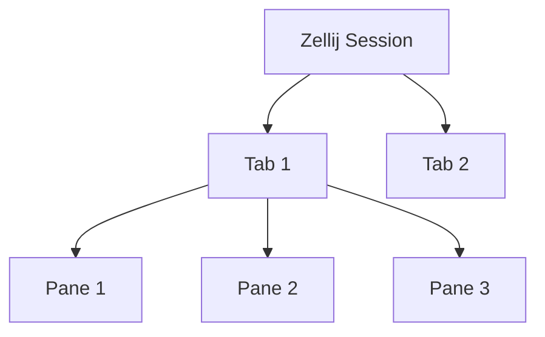

# モダンCLI環境 マスターガイド

このガイドでは、現在導入・設定済みの各ツールの操作方法を解説します。
全てのツールは **Vimライクな操作** に統一されています。

---

## 1. ターミナル: Ghostty
GPU加速による超高速ターミナルです。

### 基本操作
- `Cmd + t`: 新しいタブを開く
- `Cmd + w`: タブを閉じる
- `Cmd + h / l`: 左右のタブに移動（Vim風）
- `Cmd + Shift + r`: 設定の再読み込み

---

## 2. ターミナルマルチプレクサ: Zellij
1つのターミナル内で複数の画面（ペイン）やタブを管理します。

### 構成イメージ

### 基本操作
- `Alt + n`: 新しいペインを作成
- `Alt + h/j/k/l`: ペイン間を移動
- `Alt + [ / ]`: タブの切り替え
- `Ctrl + b` -> `d`: セッションをデタッチ（バックグラウンド実行）
- `zellij attach`: 既存のセッションに復帰

---

## 3. ファイルマネージャ: Yazi
Rust製の高速・非同期ファイルマネージャです。

### 操作手順
1. `y` で起動（エイリアス設定済みの場合）
2. `hjkl` でディレクトリ移動
3. `Enter` でファイルを開く（Neovimが起動）
4. `j` -> `k` で入力や選択をキャンセル（Escの代わり）

### 応用
- `~`: タブ表示の切り替え
- `z`: zoxideと連携してディレクトリをジャンプ

---

## 4. Git TUI: GitUI
Gitの操作をGUIのように行える高速ツールです。

### 基本操作
- `hjkl`: リストの移動
- `s`: ファイルをステージング（Indexに追加）
- `u`: アンステージング
- `c`: コミット（エディタが開きます）
- `p`: プッシュ
- `?`: ヘルプ表示

---

## 5. エディタ: Neovim (LazyVim構成)
LSPとプラグインにより、IDE級の機能を持つエディタです。

### 基本操作
- `jk`: 挿入モードからノーマルモードへ（Escの代わり）
- `<Space> + f + f`: ファイル検索 (Telescope)
- `<Space> + f + g`: 全ファイルから文字列検索 (Grep)
- `gd`: 定義ジャンプ (Go to Definition)
- `K`: ドキュメント表示 (Hover)

---

## 6. ディレクトリ移動: zoxide
`cd` を学習機能付きの `z` に置き換えます。

### 使用例
- `z work`: `work` という名前に含まれる頻度の高いディレクトリへジャンプ
- `zi`: fzfを使ってインタラクティブにディレクトリを選択

---

## トラブルシューティング
- **表示が崩れる**: `JetBrains Mono Nerd Font` が Ghostty で正しく設定されているか確認してください。
- **Neovimのエラー**: `:Lazy` コマンドでプラグインの状態を確認し、`U` でアップデートを試みてください。
- **Zellijで固まった**: `Ctrl + q` で強制終了できます。
